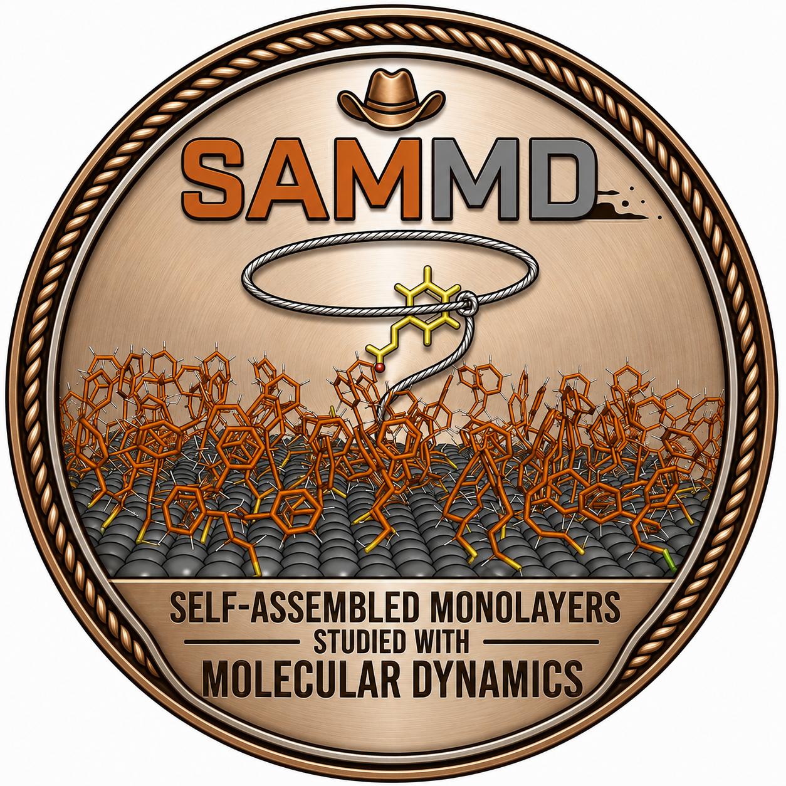

SAMMD documentation
===================

SAMMD is a configuration-first package for building and exporting
self-assembled monolayer chemistry, structure, and parameters. The YAML file
describes the surface, SAM chemistry, reactants, solvent, salts, packing,
parameterization, and build outputs. OpenMM owns minimization, equilibration,
production runs, trajectories, and reporters after those files exist.

If you are new to Python or molecular dynamics, start with
:doc:`installation and pixi basics <tutorials/installation>`, then continue to
the :doc:`beginner build workflow <tutorials/canonical-workflow>`. The first
command-line build writes ``sam_grafting_density.cif`` as a visual smoke test
for the slab and SAM grafting density before you need to write a Python script.

The current teaching workflow starts with validation and deterministic build
planning, then progresses toward OpenFF/OpenMM-backed system construction and
student-written OpenMM simulation scripts.

.. toctree::
   :maxdepth: 2
   :caption: Tutorials

   tutorials/installation
   tutorials/canonical-workflow
   tutorials/yaml-configuration
   tutorials/openmm-simulation

.. toctree::
   :maxdepth: 2
   :caption: Reference

   reference/api
   reference/build-contract

.. toctree::
   :maxdepth: 2
   :caption: Explanation

   explanation/project-scope
   explanation/scientific-assumptions

.. toctree::
   :maxdepth: 2
   :caption: Contributor guide

   contributor/developer-guide
